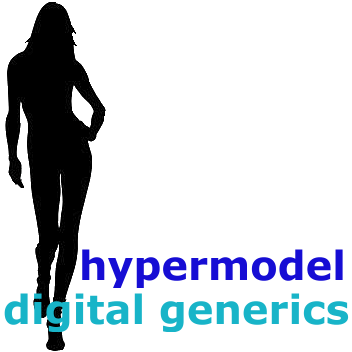

= ModelDrivenGames
Xtext and LibGDX by hypermodel

LibGDX is a cross-platform game development framework. It is a well known framework by game developers: https://libgdx.badlogicgames.com/.

Xtext is a framework for development of programming languages and domain-specific languages: http://www.eclipse.org/Xtext/.

== General
ModelDrivenGames wants to combine the two technologies, enabling a game developer to use DSL language to create large parts of the game by the Xtext code generator. If necessary, the resulting classes can be fine tuned by the developer. The final goal of this project is that nothing has to be changed after the generating process.

== Prerequisites

=== IDE
I started to use Intellij CE 2017.3 as IDE, but failed for several reasons. JetBrains stopped supporting Xtext with version 2.10. But Intellij was so buggy that I reverted to version CE 2016.3. Starting a second instance to test Xtext artifacts failed too. 

So for the moment, I use Eclipse Oxygen 2 in spite of the fact that Google stopped to support Eclipse for Android. But it works. 
You can install "IDE for DSL developers" or you must install all Xtext stuff later. Download Eclipse here: http://www.eclipse.org/downloads/packages/eclipse-ide-java-and-dsl-developers/oxygen2.

For using Android you must install ADT - http://dl-ssl.google.com/android/eclipse/. 

=== Xtext
At this time the current version of Xtext 2.13 is used. The grammar is developed in a  "first" IDE and you must start a "second" IDE (runtime-Game) from the first one, to be able to check the grammar changes on the fly. Grammar changes must be "compiled" by right clicking on the .mwe2 file and selecting Run as... MWE2 workflow. More information can be found in the Xtext documentation.

=== LibGDX
I used version 1.9.8. Due to the architecture of the Xtext projects, a plugin project was made from the libGDX jars. Together with android version 4.2.2 they form a plugin called "com.badlogic.gdx-all" including all jars. Perhaps other people will find a more nifty solution for this.

There is a book for free download "Learning libGDX Game Development" which is very good to understand the basics of game development with LibGDX. You can download it here: http://freepdf-books.com/learning-libgdx-game-development-2nd-edition/. An excellent tutorial is this one from Brent Aureli: LibGDX Game Development with Android Studio - Creating Super Mario Bros https://www.youtube.com/watch?v=a8MPxzkwBwo

=== Android
Get the latest version of Android Studio from https://developer.android.com/studio/index.html. Although you don't use Android Studio, you'll need it because you must enter the sdk path in Eclipse preferences for Android. Then you have to install the needed Android api level using the "Android SDK Manager" which is reachable from Eclipse IDE as well.

There is a problem when working with 2 IDEs and the DDMS (Dalvik Debug Monitor Server). It is already started by the 1.IDE using a batch file (ddms.bat) for Windows (wonder how it works for IOS) which is located in a directory "tools" in the SDK directory of Android. For the start of the first IDE you should rename this file so it cannot be started. Before launching the 2.IDE you must name it back. You will need the debugger in the 2. IDE. If it is already started by the 1. IDE you won't be able to use it in the 2. IDE. There should be a fancy solution for this later on.

As soon as an Android project is created, you can connect a suitable Android device to your USB port, enable debugging on that device, right click the Android project and select Debug as...
A deployable *.apk is generated and installed on your connected device.

=== DSL
The current extension for DSL model instance is ".game".

== License
The software is published under the *Apache 2.0 license*.

== Disclaimer
Although the author takes all possible care to ensure the correctness of published information, no warranty can be accepted regarding the correctness, accuracy, uptodateness, reliability and completeness of the content of this information. The author expressly reserves the right to change, to delete or temporarily not to publish the contents wholly or partly at any time and without giving notice. Liability claims against the author because of tangible or intangible damage arising from accessing, using or not using the published information, through misuse of the connection or as a result of technical breakdowns are excluded.

== Known issues
- Due to unknown effects during heavy generation of files, the generating process is looping sometimes. Normally it stops after some recursions. Somebody should look for this.
- For the moment, screens, scenes and sprites are created. No running game can be generated yet.
